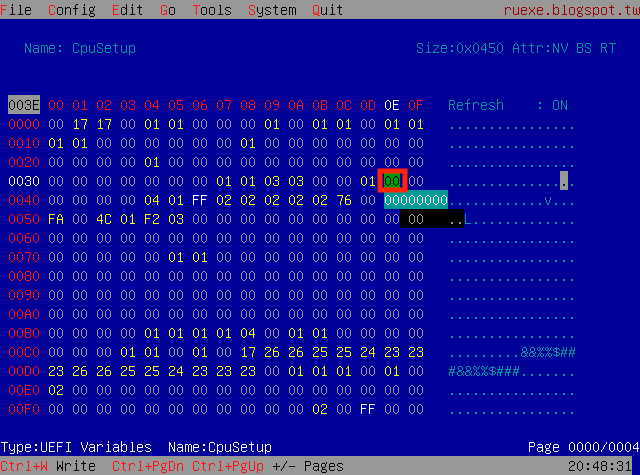
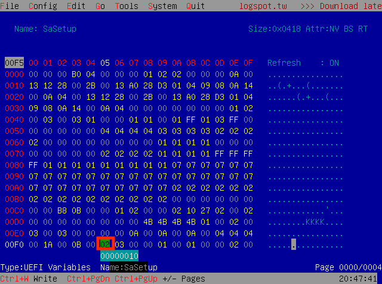
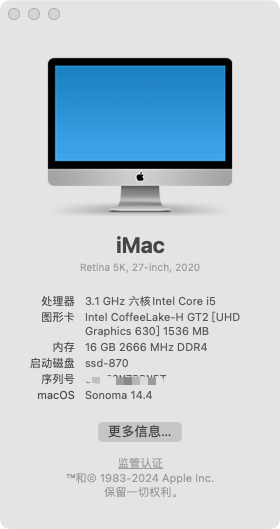
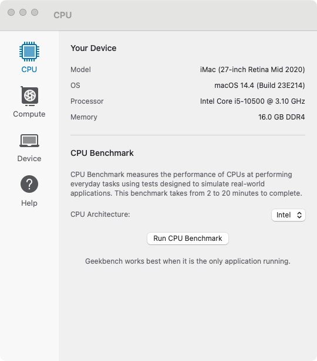
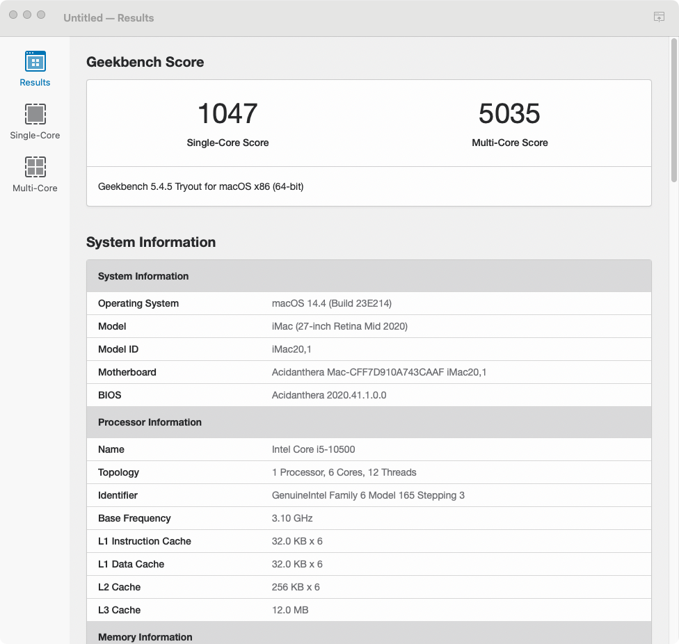

## Dell OptiPlex 3080 Small Form Factor (3080SFF) 黑苹果 OpenCore EFI

- 公司配的办公机器，居然没有intel wifi网卡，没有配wifi驱动

### 可完美运行

- macOS Monterey 12.x
- macOS Ventura 13.x
- macOS Sonoma 14.x

### OpenCore

[OpenCore 0.9.9](https://github.com/acidanthera/OpenCorePkg)

### 机器配置

- BIOS: 2.16.0
- 主板: 戴尔 B460
- 处理器: Intel 10代 i5-10500
- 内存: 海力士 16GB(2x8GB) DDR4 3200 Mhz
- 显卡: 英特尔® 超核芯显卡 630
- 声卡: Realtek ALC256
- 硬盘: 三星 870 512G
- 网卡: Realtek RTL8111HSD-CG
- 无线: 无
- 电源: 内置电源

### BIOS设置

```
System Configuration
  |-- SATA Operaition: AHCI

Video
  |-- Primary Display: Intel HD Graphics

Security
  |-- PTT Security/PTT On: Disabled

Secure Boot
  |-- Secure Boot Enable: Disabled
  |-- Secure Boot Mode: Audit Mode


Intel Software Guard Extensions
  |-- Intel SGX Enable: Disabled

PowerManagement
  |-- Deep Sleep Control: Disabled
  |-- USB Wake Support:   Disabled
  |-- Wake on LAN/WLAN:   Lan only
  |-- Block Sleep:        YES

POST Behavior
  |-- Fastboot: Minimal

```

### 注意

- 使用 [OpenCore Configurator](https://mackie100projects.altervista.org/opencore-configurator/) 替换三码
- 使用 `RU.efi` 解锁 `CFG LOCK` , 并修改核显参数 `DVMT = 64MB`

Option   | UEFI Variable Name | Address | Default | Replace
---------|--------------------|---------|---------|---------
CFG LOCK | CPUSetup           | 0x3E    | 0x1     | 0x0
DVMT     | SaSetup            | 0xF5    | 0x0     | 0x2

- 解锁 `CFG LOCK`



- 修改 `DVMT` 为 `64MB`




### 系统截图







